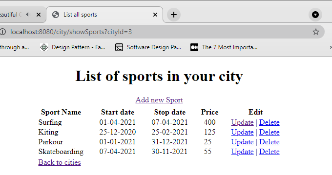

## ReadMe

In development of the project I had few steps:

1.Configurating the project(java configuration) and adding all dependencies to   pom.xml;

Configurating database(worked with Mysql) and testing the connection.

2.Create first entity sport, table for this entity and  made a crud app just for sport entity , to ensure that i can do it.(cause of that we have Sport controller separated)

3.Create city class ,table for that and made a connection between city and sport with annotation oneToMany(it could be manyTomany, but I thought that every sport has a time period and in different cities are different period for some sports) and in DB I have added a foreign key between id column from city table and a new column in sport table "city_id", in java city contains a list of sports and sport contains a city variable(for easier access id,name).

4.Create a city controller : displaying all cities, access all sports of a city, possibility of adding/removing/update a new sport when you access the city sports. At the same time we can access all sports that we have all the cities

5.For every page that can be accessed was created a view page(see below)

6.Created a controller that will process the main functionality of the app, search for sports in specified period. We have a search tab ,where we select the start and stop date and from a checkbox we can select from all the sports we have in our DB, after selection we are redirected on new page when we have all sports and cities where these can be practiced in the period that we wanted , ordered by price.

Some screenshots of the app flow

***When we access sports ref:***

***If we want to add a new sport to this city/update a sport or remove it***

**Example of add new sport form**:

***And the main functionality:***

***Selected period and sports that we want***

***The result page:***

Just like a feedback: First i want to thank Atta Systems for that experience, I had

a 2 weeks of real challenge for me(before receiving an email I have started a  spring course for beginners, have done 55% of it in first week and second week tried to do something with obtained knowledge)

I know that it had to be an Rest API project, but I looked for more information about REST API and differences between MVC and REST, was not sure what I need to do and tried to do with mvc , i think in 2-3 weeks i will know what i needed(cause the next steps in the course are about Rest api).

I think the app is  structured,easy to modify and extend.

Waiting for a feedback to know what can I do better.

Have a nice day.

​			  																					***Ghenadie Caraman***

